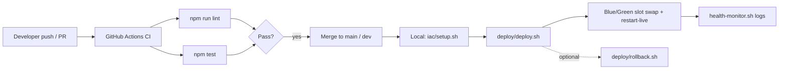
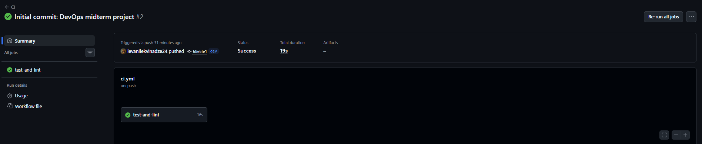
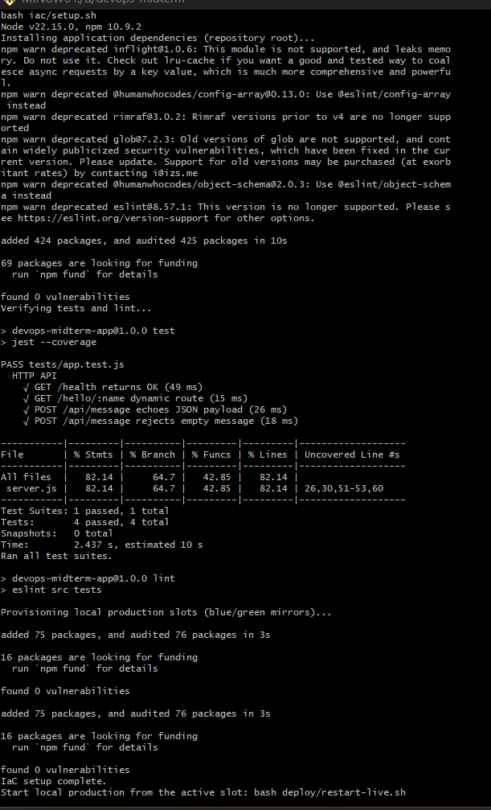
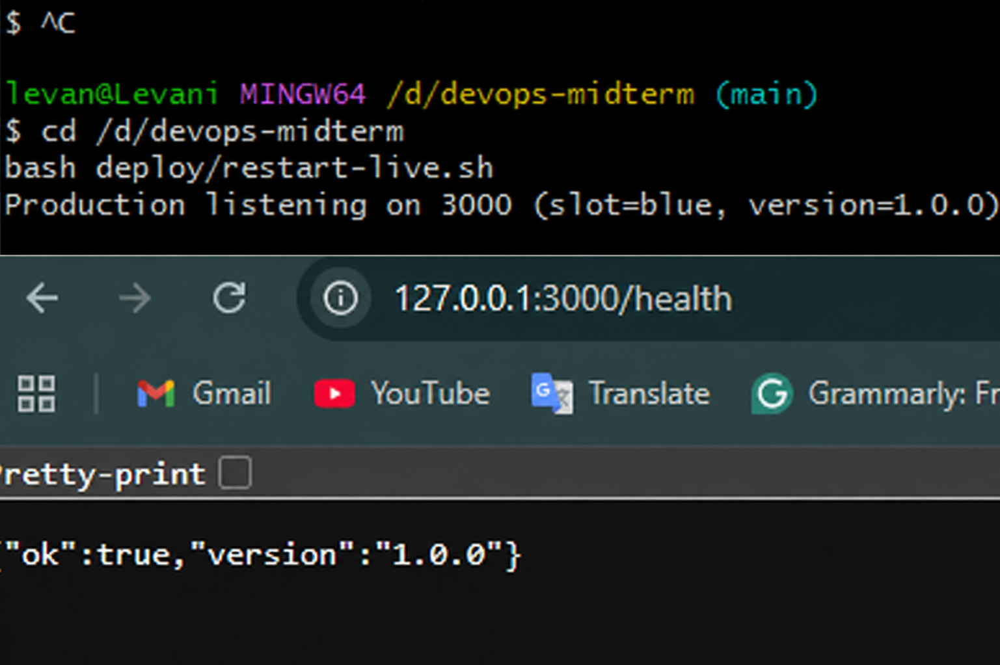
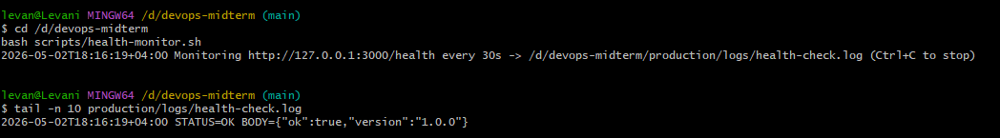

# DevOps Midterm — Web App, CI, IaC, Blue-Green CD, Monitoring

This is my DevOps midterm project: a small Express API with Jest/Supertest tests, `main` and `dev` branches, GitHub Actions CI, a one-command Bash setup script (IaC-style), a local “production” deploy with a blue/green-style simulation plus rollback, and a simple health-check monitor that logs to disk.

**Repository:** https://github.com/levanilekvinadze24/DevOps-Midterm.git

---

## Tech stack

| Area | Choices |
|------|---------|
| Web runtime | Node.js 18+ |
| Framework | Express |
| Tests | Jest + Supertest |
| Linting | ESLint |
| CI | GitHub Actions |
| IaC / automation | Bash (`iac/setup.sh`) |
| CD / blue-green | Bash (`deploy/deploy.sh`, `deploy/rollback.sh`, `deploy/restart-live.sh`) |
| Monitoring | Bash + `curl` (`scripts/health-monitor.sh`) |

---

## Repository layout (high level)

- `src/server.js` — Express app (dynamic route, form + JSON endpoint, health).
- `tests/` — Automated unit/API tests.
- `.github/workflows/ci.yml` — CI on every push/PR to `main` and `dev`.
- `iac/setup.sh` — **Single command** environment preparation (directories, dependencies, slot copies, validation).
- `deploy/` — Blue/green **simulation** for a local “production” process on one port (`PROD_PORT`, default `3000`).
- `scripts/health-monitor.sh` — Append-only health check log.
- `docs/screenshots/` — proof screenshots for the submission (see [Embedded screenshots](#embedded-screenshots)).

---

## Workflow diagram (CI/CD)



---

## Prerequisites

- **Node.js** 18 or newer (`node -v`).
- **npm** (`npm -v`).
- **Git**.
- **Bash** and **curl** on your `PATH`. On Windows, **Git Bash** or **WSL** is the easiest way to run the scripts exactly as written.

---

## Step-by-step: clone and branching

Use these steps to keep two active branches in the repo: **`main`** and **`dev`**.

1. Clone the repository and enter the folder.
2. Ensure you are on `main` (`git checkout main`).
3. Create or update **`dev`** and push both branches:

   ```bash
   git checkout main
   git pull origin main

   git branch dev        # creates dev from current HEAD if missing
   git checkout dev

   git push -u origin main
   git push -u origin dev
   ```

4. Use **feature branches** off `dev`, open pull requests into `main` or `dev`, and merge with clear commit messages (`feat:`, `fix:`, `chore:`, …).

---

## Step-by-step: run the application (development mode)
From the repository root:

```bash
npm ci
npm run lint
npm test
npm start
```

If port `3000` is already in use:

Git Bash / WSL:

```bash
PORT=4000 npm start
```

PowerShell:

```powershell
$env:PORT=4000; npm start
```

Smoke checks:

- Health JSON: `http://127.0.0.1:3000/health` (or `http://127.0.0.1:4000/health`)
- Dynamic route: `http://127.0.0.1:3000/hello/YourName` (or `http://127.0.0.1:4000/hello/YourName`)
- HTML form: `http://127.0.0.1:3000/form` (or `http://127.0.0.1:4000/form`)

---

## Step-by-step: IaC — one-command environment preparation

The assignment requires fully automated preparation via **one command**. This project uses **`iac/setup.sh`** for that purpose.

1. Optional (Unix-like): ensure the script is executable:

   ```bash
   chmod +x iac/setup.sh deploy/deploy.sh deploy/rollback.sh deploy/restart-live.sh scripts/health-monitor.sh
   ```

2. Run the IaC provisioning script:

   ```bash
   bash iac/setup.sh
   ```

**What `iac/setup.sh` does:**

- Verifies **`node`** and **`npm`** are installed.
- Creates required directories (`deploy/slots/blue`, `deploy/slots/green`, `production/logs`, `docs/screenshots`).
- Runs `npm ci` at the repo root so dependencies match CI.
- Runs **`npm test`** and **`npm run lint`** locally (mirrors CI expectations).
- Copies `package.json`, `package-lock.json`, and `src/` into both blue/green slots and runs `npm ci --omit=dev` in **each slot** — your local “production” artifacts are reproducible offline from the lockfile.

**Screenshot proof:** capture your terminal after `bash iac/setup.sh` finishes successfully and save it as [`docs/screenshots/iac-success.png`](docs/screenshots/iac-success.png) (it is referenced below in this README).

---

## Step-by-step: continuous deployment simulation (local production)

Production is modeled as **one Node process** bound to **`PROD_PORT`** (default `3000`). Two on-disk directories, **blue** and **green**, mirror deployable artifacts. The active slot name is tracked in **`deploy/state/active-slot`**. Scripts **simulate** traffic switching by starting the server from the selected slot folder.

### A. First start after IaC

```bash
bash deploy/restart-live.sh
```

Verify: open [`http://127.0.0.1:3000/health`](http://127.0.0.1:3000/health).

### B. Blue-green style deploy (`deploy/deploy.sh`)

1. Make a visible change (for example bump `version` in `package.json`).
2. From the repo root:

   ```bash
   bash deploy/deploy.sh
   ```

**What it does:**

- Determines the **inactive** slot (`blue` vs `green`).
- Syncs sources and reinstalls prod dependencies (`npm ci --omit=dev`) in that slot.
- Warms it on a temporary high port (`${PROD_PORT} + 9000`) using `/health`.
- Writes the **previous** live slot into `deploy/state/previous-slot` and sets `deploy/state/active-slot` to the warmed slot.
- Restarts production via **`deploy/restart-live.sh`**.

Confirm the running version responds in JSON from `/health`.

### C. Rollback (`deploy/rollback.sh`)

After at least **one deploy** swapped slots (so `previous-slot` differs from `active-slot`):

```bash
bash deploy/rollback.sh
```

This **swaps** the recorded slots and restarts the process from the prior slot directory — reverting quickly without rebuilding the code from scratch.

**Rollback pitfall:** Immediately after IaC **without** deploying, **`active-slot` and `previous-slot` match** (`blue`) — rollback intentionally refuses to continue to avoid ambiguity.

---

## Step-by-step: monitoring & health check script

Run the monitor **after** production is listening on the expected port:

```bash
bash scripts/health-monitor.sh &
```

Customize if needed:

- `PROD_PORT` — must match production (default `3000`).
- `HEALTHCHECK_URL` — full URL override (default `http://127.0.0.1:$PROD_PORT/health`).
- `HEALTH_INTERVAL_SEC` — seconds between probes (default `30`).

Output file: **`production/logs/health-check.log`** (append-only).

Stop the monitor: foreground run uses `Ctrl+C`; background jobs use `jobs`/`fg` and interrupt, or terminate the subshell PID from your terminal.

---

## Continuous integration (GitHub Actions)

Workflow file: [`.github/workflows/ci.yml`](.github/workflows/ci.yml).

**Triggers:** every **push** and **pull_request** touching branches **`main`** and **`dev`**.

**Steps:** `npm ci` → `npm run lint` → `npm test -- --coverage`.

### Embedded screenshots

Save screenshots under `docs/screenshots/` using the filenames below so the image links in this README keep working.

| File | What to capture |
|------------------|-----------------|
| [`docs/screenshots/ci-success.png`](docs/screenshots/ci-success.png) | Green workflow run summary in GitHub Actions. |
| [`docs/screenshots/iac-success.png`](docs/screenshots/iac-success.png) | Terminal showing successful `bash iac/setup.sh` completion. |
| [`docs/screenshots/deploy-app.png`](docs/screenshots/deploy-app.png) | Browser or `curl` showing running app (e.g. `/health` or `/form`) after deploy. |
| [`docs/screenshots/monitor-log.png`](docs/screenshots/monitor-log.png) | Editor/terminal tail of `production/logs/health-check.log`. |

Embedded images (they will render on GitHub once the files exist in `docs/screenshots/`):









---

## CI vs local quick reference

| Task | Local | CI |
|------|-------|----|
| Install | `npm ci` | `npm ci` |
| Lint | `npm run lint` | `npm run lint` |
| Tests | `npm test` | `npm test -- --coverage` |

---

## Requirements checklist (mapping)

| Requirement | How it is met |
|-------------|----------------|
| Web app + dynamic route | `GET /hello/:name` |
| Input form / endpoint | `GET /form` + `POST /api/message` |
| Automated unit test | `tests/app.test.js` |
| Two branches `main` + `dev` | Documented above; create/push both |
| CI on push/PR | `.github/workflows/ci.yml` |
| CI runs tests + lint | `npm test`, `npm run lint` |
| IaC — single command env prep | `bash iac/setup.sh` |
| CD to local production | `deploy/restart-live.sh`, `deploy/deploy.sh` |
| Blue-green simulation + rollback | Slot directories + scripts above |
| Monitor health periodically + log file | `scripts/health-monitor.sh` → `production/logs/health-check.log` |

---

## License

MIT (see [`package.json`](package.json)).
